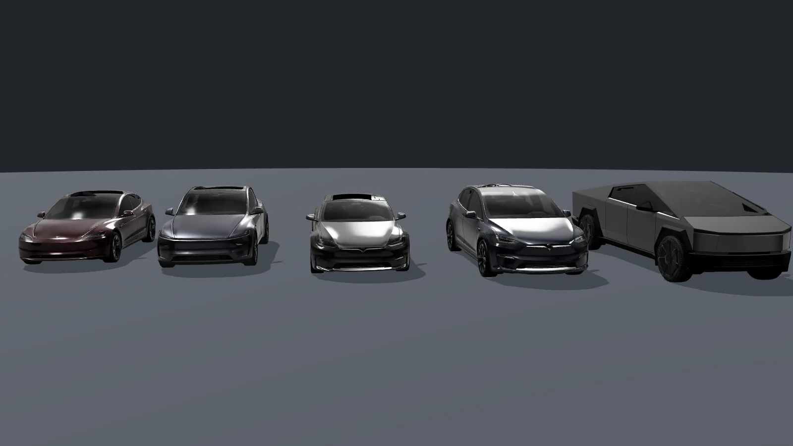
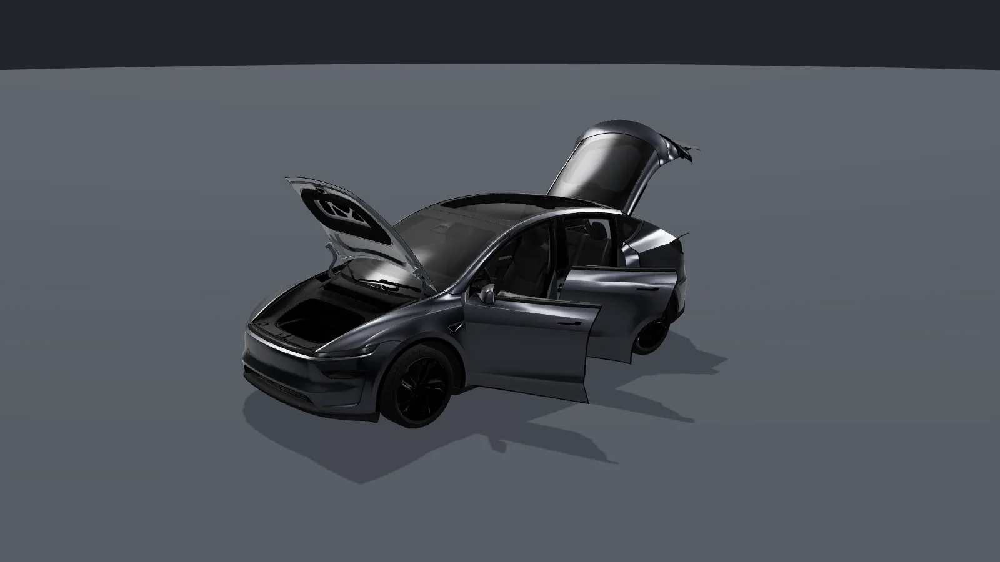
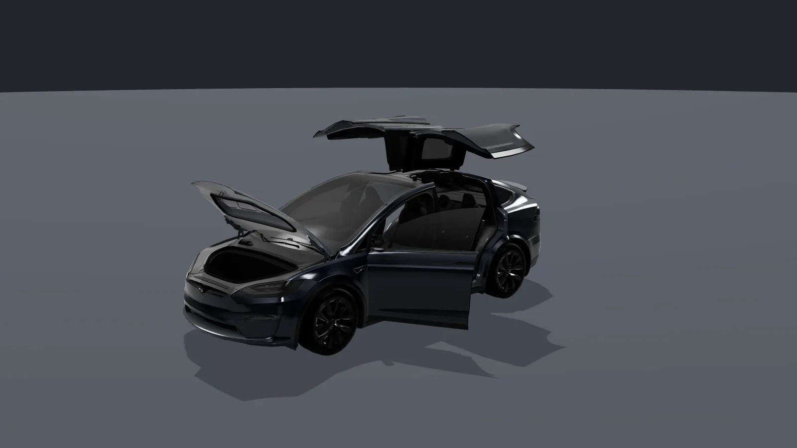
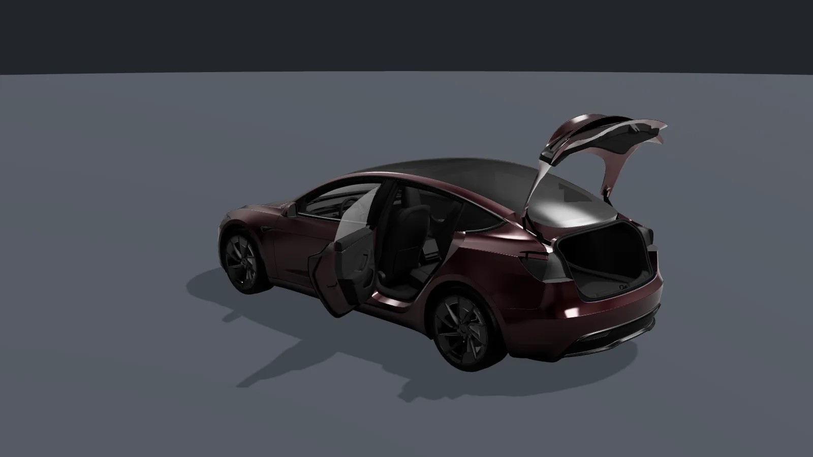
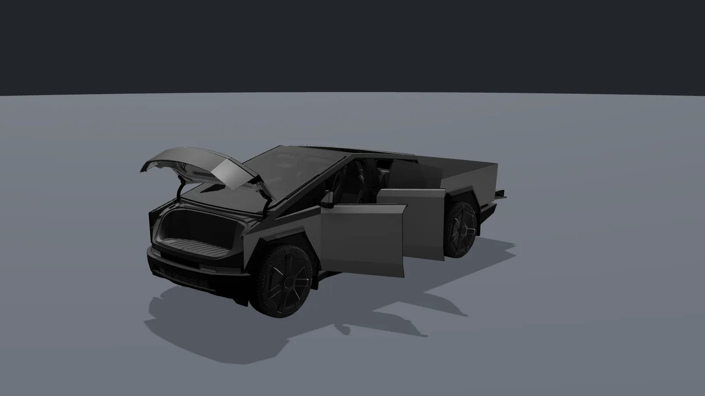

# tesla-model-extractor

Extract the **3D vehicle models** of the Tesla mobile app from a copy of the app that you own: meshes, textures,
PBR materials, closure animations (frunk, trunk, doors, windows, charge port), wheels, brakes, paints and the studio
lighting of every car the app can show (Model 3, Model Y, Model S, Model X, Cybertruck, Semi, in their generations).

The app renders its cars with an embedded Godot engine project. This tool unpacks the Android bundle, recovers that
project with [GDRE Tools](https://github.com/GDRETools/gdsdecomp) and converts it into formats you can actually use:

| output | for | command |
|---|---|---|
| **GLB per vehicle** with materials, animations, wheels and brakes baked in, plus a JSON sidecar | Unreal Engine, Blender, Unity, three.js, any glTF importer | `tesla-model-extract unreal` |
| **COLLADA (.dae) per vehicle** with materials, wheels and brakes baked in, plus textures and a JSON sidecar | Sweet Home 3D, Blender, MeshLab, any Collada importer | `tesla-model-extract dae` |
| **Asset pack** (zip with GLB + JSON overrides + textures + manifest) | the [Tesla View](https://github.com/koenhendriks/tesla-view) Home Assistant card | `tesla-model-extract extract` (default) |

Not a terminal person? The [desktop app](#desktop-app) does the same in a window on Linux, macOS and Windows:
drop in your bundle, tick the cars, click Export.

> **You must own the app bundle.** This tool never downloads the Tesla app. Everything it produces contains
> Tesla-owned material; use it for your own car and projects and do not redistribute it. See [LICENSE](LICENSE) for
> the trademark note.



| | |
|---|---|
|  |  |
| Model Y (2025): frunk, trunk with struts, doors, windows and charge port are separate animation clips | Model X: the falcon-wing doors are two-stage clips, driven like every other closure |
|  |  |
| Model 3 Highland: trunk, rear door and charge port open, front window down | Cybertruck: stainless body from the app's `paint_mix` shader, frunk and doors open |

The images are the exported GLB files rendered with three.js in the app's studio environment; every open part is a
glTF animation contained in the file, posed at its end frame.

## Desktop app


The easiest way: no installation, no terminal. Every
[release](https://github.com/koenhendriks/tesla-model-extractor/releases/latest) has a ready-to-run app; it contains
Python and everything else it needs, and downloads GDRE Tools (pinned version, checksum-verified) on first use. All
you need is the Android bundle of the Tesla app (`Tesla_<version>.apks` / `.apkm` / `.xapk` / `.apk`) from a device
you own, e.g. exported with an APK exporter app; version 4.60 or newer is what this tool is tested against.

| system | download | first start |
|---|---|---|
| Windows 10/11 (x64) | `tesla-model-extractor-<version>-windows-x64.exe` | SmartScreen says "Windows protected your PC": click **More info → Run anyway** |
| macOS 11+ (Apple Silicon) | `tesla-model-extractor-<version>-macos-arm64.zip` | unzip, then see the note below |
| macOS 11+ (Intel) | `tesla-model-extractor-<version>-macos-x86_64.zip` | unzip, then see the note below |
| Linux (x86_64, desktop with X11 or Wayland) | `tesla-model-extractor-<version>-linux-x86_64` | make it executable (file properties → *Allow executing*, or `chmod +x`), then double-click or run it |

The binaries are not signed with a paid Apple / Microsoft certificate, which is why the system asks once. On macOS,
right-click (or Control-click) **Tesla Model Extractor.app → Open → Open**; on macOS 15 and newer, open it once,
then go to **System Settings → Privacy & Security** and click **Open Anyway**. Or clear the download flag in a
terminal: `xattr -dr com.apple.quarantine "Tesla Model Extractor.app"`. `SHA256SUMS` in the release lists the
checksums of all files.

The app opens in a **wizard** that makes a Home Assistant asset pack; **Back** returns to the previous step at any
point:

1. **Drop your bundle** on the window, or click the box (or **Choose file…**) to pick it.
2. Reading the bundle **starts by itself**. The first time takes a few minutes and needs about 2 GB of free disk
   space; the recovered project (≈ 1.4 GB) is kept, so the same bundle opens instantly next time. **Clear cache** on
   the first step (it shows how much space the kept bundles take) deletes them all.
3. **Tick the cars** you want (name, size and whether the bundle contains them) and click **Next**.
4. **Choose the folder** and click **Export**; the log shows what is being converted and written. You get one zip with
   all selected cars and the wheels of each car's family. Home Assistant accepts up to 100 MiB per upload, so when the
   cars together would be larger, the app measures each car (shared wheels and cables counted once) and spreads them
   over as few zips as needed; all twelve cars of app 4.60.5 become two zips of about 95 MiB. Upload each zip in Home
   Assistant under **Settings → Devices & services → Tesla View → Configure → Upload asset pack**.

**Go to advanced manual mode** on the first step opens every option on one page: GLB files for Blender, Unreal,
Unity or three.js with paint, look, wheels and brakes, one pack per car, size limits, your own GDRE Tools, extra
rules and the recovery cache. A bundle the wizard already read carries over, and **Back to the simple wizard**
returns. The advanced mode also accepts an asset pack zip made earlier, to turn it into GLB files
without the bundle.


The advanced options map one to one onto the command line; **Advanced → Same as CLI** shows the equivalent
`tesla-model-extract` command:

| in the app | CLI |
|---|---|
| Paint | `unreal --paint NAME` |
| Look: Performance, Right-hand drive, 7 seats, EU / US plate | `unreal --variant performance,rhd,seats_7,plate_eu\|plate_us` |
| Wheels / Brakes (GLB) | `unreal --wheels default\|none\|NAME`, `--brakes default\|none\|SET` |
| Extras: separate wheel GLBs, charge cables, keep every part, keep normal-map green | `--separate-wheels`, `--cables`, `--keep-all`, `--keep-normal-y` |
| Rotate | `unreal --yaw DEG` |
| Paint brightness | `unreal --paint-brightness FACTOR` |
| Wheels (asset pack): family / every wheel / only these | `extract --wheels family\|all\|NAME,…` |
| One zip for all (…split when over the size limit), unzipped folder, size limit | `extract --bundle` (`--split`), `--dir`, `--max-size MIB` |
| Advanced: GDRE Tools, never download, extra rules | `--gdre PATH`, `--no-download`, `--rules DIR` |

On Linux and macOS the same binary also runs the CLI when given a command, e.g.
`./tesla-model-extractor-<version>-linux-x86_64 list Tesla_4.60.5.apkm`. With Python, `pip install
"tesla-model-extractor[gui] @ git+https://github.com/koenhendriks/tesla-model-extractor"` installs the app as
`tesla-model-extractor-gui` (or `tesla-model-extract gui`).

## Quick start (command line)

1. Get the Android bundle of the Tesla app (`Tesla_<version>.apks` / `.apkm` / `.xapk` / `.apk`) from a device you
   own, e.g. with an APK exporter app or `adb`. Version 4.60 or newer is what this tool is tested against.
2. Run the extractor (pick one):

   **Docker** (nothing to install, GDRE Tools bundled):
   ```bash
   docker run --rm -v "$PWD":/work ghcr.io/koenhendriks/tesla-model-extractor unreal /work/Tesla_4.60.5.apkm --all -o /work/unreal
   ```
   Add `-it` for the interactive vehicle picker and a table that uses your full terminal width.

   **Python** (3.11+; GDRE Tools is downloaded once, checksum-verified, into `~/.cache/tesla-model-extractor/`):
   ```bash
   pipx install git+https://github.com/koenhendriks/tesla-model-extractor   # or: pip install git+https://…
   tesla-model-extract list Tesla_4.60.5.apkm                # what is in the bundle
   tesla-model-extract unreal Tesla_4.60.5.apkm --models bayberry --paint Quicksilver -o unreal/
   ```

The first run takes a few minutes: GDRE recovers the whole 450 MB Godot project (≈ 1.4 GB once recovered). Pass
`--keep-recovered DIR` to reuse it for later runs (`--recovered DIR` skips straight to conversion).

```
$ tesla-model-extract list Tesla_4.60.5.apkm
 id            name                                   codename     API model / fascia                          wheels           raw MB
 bayberry      Model Y (2025+) Premium / Performance  Bayberry     modely (baseBayberry, performanceBayberry)  6 (Crossflow19)  23.6
 bayberry_e41  Model Y (2025+) Standard               BayberryE41  modely (e41Bayberry)                        6 (E4118)        32.8
 bayberry_e80  Model Y L (long wheelbase)             BayberryE80  modely                                      6 (MachinaV219)  25.3
 y_high        Model Y (2020–2024)                    Y_High       modely                                      15 (Gemini)      19.7
 poppyseed     Model 3 (2024+ Highland)               Poppyseed    model3 (basePoppyseed, …)                   4 (Wishbone20)   20.7
 model3_high   Model 3 (2017–2023)                    3_High       model3                                      …
 model_s / s_palladium / model_x / x_palladium / cybertruck / semi …
```

## GLB export (Unreal Engine, Blender, any glTF importer)

`unreal` writes one folder per vehicle with a **self-contained glTF 2.0 binary**:

* the mesh hierarchy with the app's real PBR materials: repacked metallic / roughness / occlusion textures, normal
  maps, emission, alpha blending, double-sided flags, UV tiling, clear-coat car paint from the app's paint table
  (brightened for a normally lit scene: the app stores its paints about ten times darker, see `--paint-brightness`);
* the closure animations as glTF node animations on the pivot nodes (frunk, trunk with struts, doors, windows,
  mirrors, charge port, falcon doors, Cybertruck tonneau and suspension);
* the vehicle's default wheel under each wheel pivot and the standard brakes under the brake pivots;
* the app's hotspot markers as empty nodes;
* one look baked in (standard fascia, LHD, EU plate, 5 seats); pick others with `--variant`, keep everything with
  `--keep-all`;
* `unreal.json`: what glTF cannot carry (light groups, parts hidden until a state turns them on, closures, markers,
  paint table, environment presets), plus `paints.json` and the studio panorama.

```bash
tesla-model-extract unreal Tesla_4.60.5.apkm --all -o unreal/
tesla-model-extract unreal Tesla_4.60.5.apkm --models bayberry --paint Quicksilver --variant performance,plate_us
tesla-model-extract unreal Tesla_4.60.5.apkm --models model_s --wheels none --brakes none --separate-wheels --cables
tesla-model-extract unreal tesla-view-pack-bayberry-4.60.0.zip     # from an asset pack you already built
```

Import steps for Unreal Engine 5, the Godot → glTF material mapping, the sidecar format and an FBX conversion
script for Blender are in [docs/unreal-export.md](docs/unreal-export.md). Every file passes the Khronos glTF
validator and loads in Blender, three.js and `<model-viewer>` as well.

## DAE export (Sweet Home 3D, Blender, MeshLab)

`dae` writes the same assembled vehicle as `unreal` (one baked-in look, wheels, brakes, optional `--exclude`
filtering) as **COLLADA (.dae) + textures**, for tools with a mature Collada importer. Sweet Home 3D is the
best-tested target, since it is Collada-native; Blender (4.2.x) and MeshLab also import the files correctly.
Collada has no animation support in this export, so closures are written in their default, closed pose, and
Collada-phong materials are an approximation of the app's PBR materials (metallic/roughness, clear-coat and
occlusion textures have no equivalent and are dropped; see `dae.json` for exactly what was approximated per
material).

```bash
tesla-model-extract dae Tesla_4.60.5.apkm --models bayberry --paint Quicksilver -o dae/
tesla-model-extract dae Tesla_4.60.5.apkm --models poppyseed --exclude "*frost*,*_RHD*" -o dae/
```

Each vehicle gets its own folder with `<Codename>.dae`, a `textures/` folder and a `dae.json` sidecar (same shape
as `unreal.json`, plus notes on anything Collada-phong could not represent).

| option | meaning |
|---|---|
| `--exclude PATTERN[,PATTERN]` | drop nodes whose name matches one of these glob patterns (case-insensitive), e.g. `*frost*,*_RHD*` |

All other options (`--models`, `--all`, `--paint`, `--variant`, `--wheels`, `--brakes`, `--yaw`, `--keep-all`,
`--keep-normal-y`, `--paint-brightness`) work the same as for `unreal`.

## Asset packs for the Tesla View Home Assistant card

`extract` (the default command) builds one zip per vehicle (8–25 MiB; Home Assistant accepts uploads up to 100 MiB)
containing the vehicle's GLB, textures, per-surface material overrides, closure animations as JSON, the wheels of
its family, brake calipers, charge cables, the paint table, the studio panorama and a `manifest.json` describing all
of it. The card interprets these at runtime, which is why this output stays renderer-agnostic. The format is
documented in [docs/asset-pack-format.md](docs/asset-pack-format.md).

```bash
tesla-model-extract Tesla_4.60.5.apkm --models bayberry -o packs/
```

Upload the zip in Home Assistant: **Settings → Devices & services → Tesla View → Configure → Upload asset pack**
(or during the initial setup, or from the *Repairs* item the integration raises while no pack is installed).

The card currently renders GLB-based vehicles fully (the Model Y family, Model 3 Highland, …). Packs for the other
vehicles are produced on a best-effort basis: unknown scenes get generic rules, and features the card cannot map yet
are listed under `warnings` in the manifest.

## Usage

```
tesla-model-extract [extract] <bundle|recovered-dir> [-o OUT] [--models ID[,ID]] [--all] [--wheels family|all|NAME,…]
                    [--bundle | --split] [--dir] [--max-size MIB] [--keep-recovered DIR | --recovered DIR]
                    [--gdre PATH] [--no-download] [--rules DIR] [--yes] [--json]
tesla-model-extract unreal   <bundle|recovered-dir|pack.zip> [-o DIR] [--models ID[,ID]] [--all] [--paint NAME]
                    [--variant V[,V]] [--wheels default|NAME|none] [--brakes default|SET|none]
                    [--separate-wheels] [--cables] [--keep-all] [--yaw DEG] [--keep-normal-y]
                    [--paint-brightness FACTOR]
tesla-model-extract dae      <bundle|recovered-dir|pack.zip> [-o DIR] [--models ID[,ID]] [--all] [--paint NAME]
                    [--variant V[,V]] [--wheels default|NAME|none] [--brakes default|SET|none]
                    [--keep-all] [--yaw DEG] [--keep-normal-y] [--paint-brightness FACTOR]
                    [--exclude PATTERN[,PATTERN]]
tesla-model-extract list     <bundle|recovered-dir>        # vehicles, wheels, paints in the bundle
tesla-model-extract inspect  <bundle|recovered-dir> <id>   # bindings / animation players / markers of one scene
tesla-model-extract validate <pack.zip|dir>                # asset pack: schema, referenced files, node names, size
tesla-model-extract gui                                    # the desktop app (needs the `gui` extra)
```

| option | meaning |
|---|---|
| `--models bayberry,bayberry_e41` | which vehicles (ids, codenames or aliases such as `juniper`). Default: interactive, or the first Model Y with `--yes` |
| `--all` | every vehicle in the bundle |
| `--keep-recovered DIR` / `--recovered DIR` | keep / reuse the GDRE recovery (≈ 1.4 GB) |
| `--gdre PATH`, `--no-download` | use your own GDRE Tools binary; never download it |
| `--rules DIR` | extra `<codename>.yaml` rules (see [docs/rules.md](docs/rules.md)) |
| `--wheels family` (extract) | (default) all wheel scenes of the vehicle's wheel family; `all` = every wheel; or a list of API names (`Crossflow19,HelixV220`) |
| `--bundle` (extract) | one zip with all selected models; fails validation when it exceeds `--max-size` (100 MiB, the HA upload limit) |
| `--split` (extract) | like `--bundle`, but spreads the models over as few zips as needed to keep each under `--max-size` (what the desktop app's wizard does) |
| `--dir` (extract) | write an unzipped pack directory (for development against the card) |

Reproducible builds: set `SOURCE_DATE_EPOCH` to pin `generated_at`; everything else is deterministic.

Exit codes: 0 ok · 1 error · 2 a selection is required (no TTY) · 3 the produced pack failed validation.

The command was called `tesla-view-extract` before 0.3; that name still works.

## How it works

1. **Unpack**: the inner APK that contains `assets/godot/project.binary` is located by content and only
   `assets/godot/**` is extracted.
2. **Recover**: `gdre_tools --headless --recover` turns the exported Godot 3.2 project back into `.tscn`/`.tres`/
   `.gd` text, `.glb` models and `.png` textures. Binary `.material` files are converted on demand with `--bin-to-txt`.
3. **Convert**: each vehicle `.tscn` becomes an `*.overrides.json` (node transforms/visibility, per-surface material
   descriptions); `Animation` resources become JSON keyframes (including the inline trunk clip with its strut tracks,
   and the older per-property translation/rotation tracks); GDScript tables are scraped for paints, wheel enums,
   charge cables, the vehicle routing table and the environment/camera presets.
4. **Rules**: `rules/_default.yaml` maps the scene root's exported NodePath *bindings* (`drl_path`, `lf_door_path`,
   `fascia_perf_path`, …) to channels: light groups, variants (performance / RHD / plates / 7 seats), closures,
   pivots, markers. `rules/<codename>.yaml` adds names, aliases and per-model tweaks. Unknown scenes still produce
   usable output from the defaults.
5. **Pack**: only referenced files are copied (seasonal wrap skins excluded), written as a deterministic zip and
   validated. **Or assemble**: the `unreal` exporter merges the GLB, overrides, wheels, brakes and animations into one
   glTF document, translating Godot materials to glTF PBR on the way.

## Development

```bash
uv venv && uv pip install -e ".[dev,gui]"  # or python -m venv .venv && pip install -e ".[dev,gui]"
pytest -q                                    # synthetic fixtures only: no Tesla content in this repo
ruff check src tests packaging && mypy
python scripts/check_no_assets.py            # CI guard against accidentally committed app material
tesla-model-extract compare-legacy pack.zip <old assets dir>   # regression check against a known-good pack
tesla-model-extract gui                      # run the desktop app from the checkout
```

The GUI tests run headless with `QT_QPA_PLATFORM=offscreen`. The pipeline both front ends share lives in
`service.py`; the CLI (`cli.py`) and the app (`gui/`) only collect options and show results.

Building the desktop binary for the machine you are on (the
[Desktop app workflow](.github/workflows/release.yml) does this for Linux, Windows and both macOS architectures):

```bash
pip install -e ".[gui,build]"
python packaging/make_icon.py build                        # icon.png / .ico / .icns, drawn in code
pyinstaller --noconfirm packaging/tesla-model-extractor.spec
dist/tesla-model-extractor --smoke                         # macOS: "dist/Tesla Model Extractor.app/Contents/MacOS/tesla-model-extractor"
```

Releasing: bump the version in `pyproject.toml` and `src/tesla_model_extractor/__init__.py`, commit, and push a
`vX.Y.Z` tag. The tag publishes the Docker image and builds the four binaries into a GitHub Release with a
`SHA256SUMS` file (a `vX.Y.Z-rc1` style tag makes a pre-release). Pull requests that touch the app or its packaging
build the binaries without releasing them.

Adding support for a vehicle: run `tesla-model-extract inspect <bundle> <codename>` to see its bindings, animation
players and markers, then write `rules/<codename>.yaml` (see [docs/rules.md](docs/rules.md)).

## License

MIT for the code in this repository. Tesla, Model 3, Model Y, Model S, Model X, Cybertruck and Semi are trademarks
of Tesla, Inc.; the extracted material is theirs. This project is not affiliated with or endorsed by Tesla.
